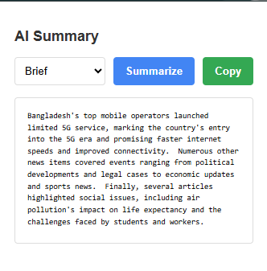
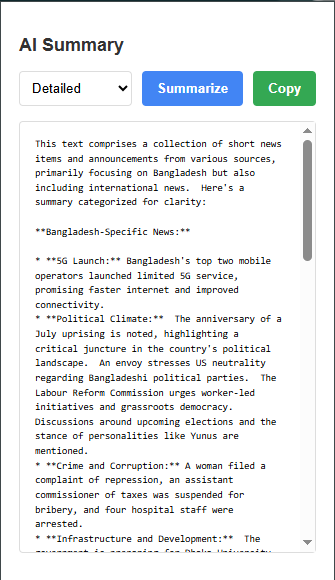
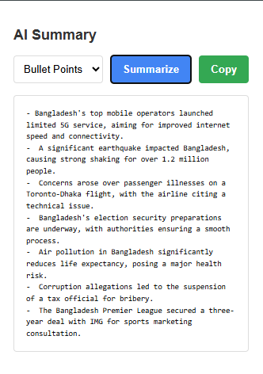

# AI Summary for Articles Chrome Extension

## Overview

This Chrome extension provides an AI-powered summary feature for web articles. Users can generate brief, detailed, or bullet-point summaries of the content on any webpage using the Gemini API.

## Features

- Summarize articles in three formats: Brief, Detailed, or Bullet Points.
- Copy the generated summary to the clipboard with a single click.
- Configurable via an options page to set the Gemini API key.
- Works on any webpage with detectable article content.

## Installation

1. Clone the repository or download the source code.
2. Open Chrome and navigate to `chrome://extensions/`.
3. Enable "Developer mode" in the top right.
4. Click "Load unpacked" and select the extension directory.
5. Configure your Gemini API key in the options page.

## Usage

1. Click the extension icon on any webpage.
2. Select a summary type (Brief, Detailed, or Bullet Points) from the dropdown.
3. Click "Summarize" to generate the summary.
4. Click "Copy" to copy the summary to your clipboard.

## Configuration

- Visit the options page (accessible via the extension icon) to enter your Gemini API key.
- Obtain an API key from [Google AI Studio](https://makersuite.google.com/app/apikey).

## Files

- `popup.html`: The popup interface.
- `popup.js`: Handles summary generation and copy functionality.
- `content.js`: Extracts article text from webpages.
- `background.js`: Manages extension installation and API key checks.
- `options.html` and `options.js`: Options page for API key configuration.
- `manifest.json`: Extension manifest file.

## Screenshots

- 

- 

- 

## Requirements

- Chrome browser (Manifest V3 compatible).
- Gemini API key from Google AI Studio.

## Contributing

Feel free to submit issues or pull requests on the GitHub repository. Contributions are welcome!

## Contact

- **GitHub**: [khadija-T](https://github.com/khadija-T)
- **Email**: [khadija.t20037@gmail.com](mailto:khadija.t20037@gmail.com)
- **LinkedIn**: [Khadijatull Kobra](https://www.linkedin.com/in/khadijatull-kobra-80b1a9348)
